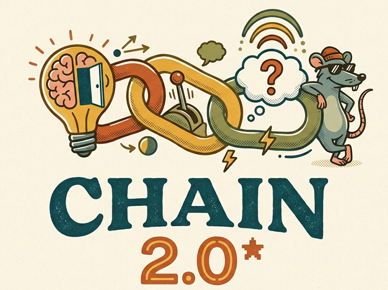

<p align="center">
  
</p>

# Software Chain 2.0 - Experimento de cadeia comportamental com dicas verbais condicionais - versão para Lab.js

Este repositório contém uma **plataforma experimental em Lab.js** para condução de tarefas de desempenho sequencial com **cadeia de elos configuráveis** e **liberação condicional de dicas verbais**. O software preserva a lógica central do experimento original, mas reorganiza a implementação em camadas legíveis, melhora a interface, corrige problemas funcionais e amplia a **rastreabilidade dos dados**, incluindo exportação automática em `XLSX` e geração de log textual estruturado.

Mais do que uma simples interface de coleta, o sistema deve ser entendido como um **instrumento de pesquisa parametrizável**, apropriado para protocolos que investiguem seleção sequencial, controle de estímulos, evocação por pistas, respostas verbais sob dicas e desempenho sob diferentes critérios de progressão e encerramento.

##
## Laboratório de Análise Experimental do Comportamento (LAEC)

<p align="center">
  
</p>

### Linha de pesquisa

- **Análise do Comportamento**
- Objetivos: análise experimental de processos comportamentais básicos e complexos, como o efeito de contingências de reforço, comportamento verbal e linguagem, controle de estímulos e seguimento de regras, comportamento de escolha em humanos e não humanos e privacidade.
- Aplicações: análise funcional do comportamento em contextos clínico, escolar e organizacional, análise do comportamento do consumidor e uso e avaliação de técnicas verbais e não verbais na modificação do comportamento infantil e adulto.

### Áreas do conhecimento

- `7.07.02 - Psicologia Experimental`
- `7.07.02.02-0 - Processos de Aprendizagem, Memória e Motivação`
- `7.07.10 - Tratamento e Prevenção Psicológica`

### Fichas presentes na tela inicial

<table>
  <tr>
    <td width="180" align="center" valign="top">
      <br>
      <strong>Software Chain 2.0</strong><br>
      <sub>Software experimental</sub>
    </td>
    <td valign="top">
      Plataforma experimental utilizada neste projeto para condução de tarefas de desempenho sequencial com liberação condicional de dicas verbais e configuração paramétrica das sessões. A abertura institucional desta fase integra a apresentação do LAEC à configuração do experimento, preservando o fluxo de uso, a organização visual da etapa inicial e a compatibilidade com o ecossistema Lab.js. O ambiente foi estruturado para apoiar preparação da sessão, rastreabilidade dos dados, documentação do projeto e identificação dos vínculos científicos, técnicos e institucionais associados ao experimento.
    </td>
  </tr>
  <tr>
    <td width="180" align="center" valign="top">
      <br>
      <strong>Júlio César Abdala Filho</strong><br>
      <sub>Pesquisador líder</sub>
    </td>
    <td valign="top">
      Pesquisador líder, psicólogo em Goiânia, GO, professor no curso de Psicologia da UNIALFA e do Instituto Aphosiano de Ensino Superior (IAESUP) e atuante na clínica analítico-comportamental infanto-juvenil aplicada à neurodiversidade. Graduou-se em Psicologia pela Pontifícia Universidade Católica de Goiás em 2018, com trajetória de iniciação científica vinculada ao PIBIC/CNPQ e ao PIBIT/CNPQ, e concluiu o mestrado em Psicologia (Análise Experimental do Comportamento) pela PUC Goiás entre 2022 e 2024, com financiamento PROSUC/CAPES. Atualmente é doutorando em Psicologia na mesma instituição, sob orientação do Prof. Dr. Lorismario E. Simonassi, com experiência em comportamento verbal, comportamento verbal privado, variabilidade comportamental e análise quantitativa do comportamento.<br><br>
      <strong>Currículo Lattes:</strong> <a href="http://lattes.cnpq.br/2792459900337330">http://lattes.cnpq.br/2792459900337330</a>
    </td>
  </tr>
  <tr>
    <td width="180" align="center" valign="top">
      <br>
      <strong>Lorismario Ernesto Simonassi</strong><br>
      <sub>Referência acadêmica</sub>
    </td>
    <td valign="top">
      Concluiu o Doutorado em Psicologia, na área de Psicologia Experimental, pela Universidade de São Paulo (USP) em 1988 e atualmente é professor titular da Pontifícia Universidade Católica de Goiás. Atua como consultor ad-hoc de diversas revistas científicas em Psicologia, publicou artigos em periódicos especializados, trabalhos em anais de eventos, capítulos de livros e livro, além de ter participado do desenvolvimento de produtos tecnológicos. Orienta dissertações de mestrado e teses de doutorado no Programa Stricto Sensu em Psicologia da PUC Goiás, recebeu 1 prêmio e/ou homenagem, coordena 2 projetos de pesquisa e atua com ênfase em psicologia do ensino da aprendizagem, tendo interagido com 78 colaboradores em coautorias de trabalhos científicos.<br><br>
      <strong>Currículo Lattes:</strong> <a href="http://lattes.cnpq.br/4405420791699259">http://lattes.cnpq.br/4405420791699259</a>
    </td>
  </tr>
  <tr>
    <td width="180" align="center" valign="top">
      <br>
      <strong>Gabriel Teixeira Andrade Sousa</strong><br>
      <sub>Desenvolvimento</sub>
    </td>
    <td valign="top">
      Engenheiro de Inteligência Artificial Sênior e pesquisador no CEIA-UFG, com atuação no desenvolvimento desta plataforma experimental e em projetos aplicados nas áreas de Inteligência Artificial Generativa, Processamento de Linguagem Natural e modelos de linguagem de grande porte. Graduado em Engenharia de Computação pela Pontifícia Universidade Católica de Goiás (2017-2022), com o trabalho Predição de resistência antimicrobiana em Pseudomonas aeruginosa com aprendizagem de máquina, sob orientação de Clarimar José Coelho. Atualmente é mestrando em Ciência da Computação pela Universidade Federal de Goiás, onde desenvolve, desde 2024, a pesquisa Leis de Escalonamento Industrial em Continual Pre-Training: Otimização de Misturas Intra-Domínio, sob orientação de Arlindo Rodrigues Galvão Filho e coorientação de Walcy Santos Rezende Rios.
<br><br>
      <strong>Currículo Lattes:</strong> <a href="http://lattes.cnpq.br/4244807184243359">http://lattes.cnpq.br/4244807184243359</a>
    </td>
  </tr>
</table>

## O que este repositório entrega

- `dist/main.refatorado.json`: arquivo pronto para importação no **Lab.js Builder**.
- `src/`: implementação fonte, organizada por fase (`stage1`, `stage2`, `stage3`) e por responsabilidade. A `stage1` agora concentra a apresentação institucional do LAEC e a configuração da sessão.
- `assets/`: imagens e áudios usados no experimento.
- `examples/`: arquivos de exemplo para configuração e objetos.
- `tools/build_labjs_json.py`: script para recompilar o JSON final a partir dos fontes.
- `LICENSE`: termos da licença Apache License 2.0 adotada no repositório.
- `NOTICE`: arquivo de atribuição exigido pela distribuição sob Apache 2.0.
- `docs/`: documentação complementar em Markdown, material visual derivado do PDF do projeto e a documentação formal em `.docx`.

## Caracterização científica e metodológica do experimento

### Leitura metodológica recomendada

A caracterização mais rigorosa deste software é a de uma **plataforma experimental computadorizada para investigação do desempenho sequencial sob controle de estímulos, com evocação verbal mediada por pistas liberadas segundo critério programado**. O sistema **não obriga um único enquadramento teórico**, mas é particularmente compatível com a literatura de **psicologia comportamental**, sobretudo com discussões sobre:

1. **cadeias comportamentais e aquisição de sequências de resposta**;
2. **controle de estímulos e discriminação condicional**;
3. **prompts, dicas e transferência de controle de estímulos**;
4. **respostas verbais evocadas por pistas**;
5. **recuperação por pistas e ativação semântica**, quando a tarefa exige nomeação ou evocação do item-alvo.

Em termos conceituais, a tarefa aproxima-se de arranjos de **repeated acquisition** e de **organização serial do comportamento**, nos quais o participante precisa emitir respostas em ordem correta, mantendo discriminação entre alternativas relevantes e irrelevantes ao longo de uma sequência (Boren, 1968; Johnston & Pennypacker, 2009; Kazdin, 2021). Quando o sistema libera dicas verbais após uma sequência programada de acertos, ele passa a incorporar um segundo componente metodológico: o estudo do papel de **estímulos suplementares** na probabilidade de emissão de respostas corretas, tema clássico na literatura sobre **prompts** e **transferência de controle de estímulos** (Terrace, 1963a, 1963b; Striefel, Bryan, & Aikins, 1974; Coon & Miguel, 2012; Eikeseth & Smith, 2013).

Ao mesmo tempo, como o participante pode precisar **adivinhar ou nomear** um item com base em pistas verbais sucessivas, o procedimento também dialoga com a literatura sobre **recuperação por pistas**, **priming semântico** e **ativação em redes semânticas**, especialmente quando a variável de interesse envolve evocação lexical, latência de resposta e acurácia sob pistas graduais (Tulving & Thomson, 1973; Meyer & Schvaneveldt, 1971; Collins & Loftus, 1975; Wheeler & Gabbert, 2017).

### Unidade de análise

A unidade de análise central é o **desempenho observável do participante ao longo da sessão**, decomponível em eventos elementares registrados pelo software:

- seleção correta ou incorreta de cada elo;
- tentativa realizada;
- tempo decorrido até cada evento;
- evocação sob dicas;
- acertos e erros acumulados;
- condição de término da sessão.

Assim, o repositório dá suporte tanto a análises **molares** (tempo total, escore final, motivo de encerramento) quanto a análises **moleculares** (trajetória evento a evento, distribuição de erros, posição serial, respostas às dicas e acurácia sob diferentes conjuntos de pistas).

### Variáveis experimentais diretamente manipuláveis

O protocolo pode ser parametrizado pelo pesquisador em pelo menos seis dimensões principais:

- **extensão da cadeia**: quantidade de elos na sequência;
- **modalidade do elo**: palavra e/ou imagem;
- **conteúdo do elo**: nome textual ou arquivo visual selecionado;
- **regra de liberação das dicas**: número de acertos consecutivos necessários para abrir o bloco de pistas;
- **estrutura das dicas**: resposta correta + lista de pistas verbais por conjunto;
- **critério de encerramento**: tempo, acertos, erros, tentativas ou esgotamento da cadeia.

Essas variáveis permitem construir condições experimentais distintas, por exemplo:

- cadeias curtas versus longas;
- cadeias homogêneas (apenas palavras / apenas imagens) versus mistas;
- pistas mais específicas versus mais abertas;
- liberação precoce versus tardia de dicas;
- critérios de término mais restritivos versus mais permissivos.

### Variáveis dependentes disponíveis

O software registra automaticamente indicadores úteis para análise comportamental e metodológica:

- tempo total da sessão;
- número total de tentativas;
- total de acertos e de erros;
- trajetória acumulada de acertos/erros;
- respostas emitidas nos blocos de dica;
- acertos e erros sob dicas;
- motivo de término da sessão;
- trilha textual completa (`final_log`);
- trilha estruturada em JSON (`results_json`);
- planilha `XLSX` com múltiplas abas.

Isso faz do repositório não apenas um ambiente de aplicação, mas também um sistema de **auditoria experimental e reconstrução pós-sessão**.

### Relação com a literatura da psicologia comportamental

#### 1. Cadeias comportamentais e desempenho serial

A exigência de responder em uma ordem previamente definida aproxima a tarefa da literatura sobre **cadeias comportamentais**, na qual cada resposta altera as condições para a próxima e o desempenho adequado depende de organização sequencial sob controle de estímulos. Em vez de tratar a sessão como um escore único, esta leitura permite analisar a cadeia como uma série de unidades sucessivas de resposta, sensível a posição serial, dificuldade relativa do elo e efeitos de treino (Boren, 1968; Johnston & Pennypacker, 2009).

#### 2. Controle de estímulos

O acerto em cada passo depende de o participante discriminar o estímulo relevante entre alternativas embaralhadas. Portanto, o desempenho pode ser descrito em termos de **controle discriminativo**, isto é, em que medida propriedades do ambiente experimental passam a controlar a resposta correta. Quando erros persistem, o pesquisador pode examinar se há controle por estímulos irrelevantes, saliência excessiva de certos itens, ambiguidade entre estímulos ou sobrecarga mnemônica.

#### 3. Prompts e transferência de controle

A abertura do bloco de dicas configura um arranjo de **estímulos suplementares** que aumentam a probabilidade de resposta correta. Em linguagem aplicada, as dicas funcionam como **prompts verbais** ou **pistas intraverbais**. Um uso metodologicamente robusto desse recurso não consiste em tratá-lo como mero “auxílio”, mas em examiná-lo como componente experimental: sob quais condições a dica altera a acurácia? Em que momento ela passa a ser necessária? O participante melhora depois de exposição repetida? O controle se transfere da pista para o estímulo-alvo? Essas perguntas são coerentes com a literatura clássica e aplicada sobre procedimentos de prompt e transferência de controle (Terrace, 1963a, 1963b; Striefel et al., 1974; Coon & Miguel, 2012; Eikeseth & Smith, 2013).

#### 4. Resposta verbal e evocação por pistas

Quando o participante precisa nomear o item após receber pistas, a tarefa também pode ser descrita como um arranjo de **evocação verbal sob controle de estímulos verbais antecedentes**. Dependendo do protocolo, isso permite investigar topografia verbal, precisão lexical, latência de evocação, sensibilidade à ordem das pistas e efeitos de familiaridade semântica.

#### 5. Recuperação por pistas e memória semântica

Ainda que o enquadramento principal possa ser comportamental, há espaço legítimo para interpretação complementar pela literatura de memória, sobretudo quando as dicas são semanticamente relacionadas ao alvo. Nesses casos, o desempenho pode refletir **especificidade de codificação**, **facilitação por associação semântica** e **ativação em rede**, desde que o pesquisador deixe claro que tais interpretações são inferidas a partir do protocolo e não impostas pelo software em si (Tulving & Thomson, 1973; Meyer & Schvaneveldt, 1971; Collins & Loftus, 1975; Wheeler & Gabbert, 2017).

### Desenhos experimentais recomendados

Este repositório é especialmente adequado para:

- **delineamentos intra-sujeito** com repetição de sessões;
- **delineamentos de caso único / single-case experimental designs**, quando o pesquisador deseja observar mudanças graduais no desempenho sob manipulações programadas;
- **comparações por condição**, variando extensão da cadeia, modalidade dos elos, quantidade/qualidade das dicas e critério de liberação;
- **estudos piloto**, testes de usabilidade experimental e refinamento de instrumentos.

Para estudos mais rigorosos, recomenda-se:

- explicitar operacionalmente as variáveis independentes;
- manter estáveis instruções, ambiente e hardware dentro de uma mesma condição;
- registrar claramente critérios de inclusão, exclusão e interrupção;
- considerar contrabalanceamento quando houver múltiplas versões;
- separar efeitos de treino, fadiga e familiaridade do efeito das dicas;
- documentar como o pesquisador definirá equivalência entre resposta emitida e resposta correta.

### Texto-base para descrição metodológica em projeto, dissertação ou artigo

> O procedimento foi implementado como uma tarefa computadorizada de desempenho sequencial em Lab.js, composta por três fases: configuração da sessão, definição dos elos da cadeia e execução experimental. Na fase de execução, os estímulos são apresentados em ordem embaralhada e o participante deve selecionar os itens na sequência correta. O protocolo permite a programação de cadeias de diferentes extensões, compostas por palavras, imagens ou combinações de ambas, além da definição de critérios de encerramento por tempo, acertos, erros, tentativas ou conclusão da cadeia. Adicionalmente, o sistema possibilita a liberação condicional de conjuntos de dicas verbais após uma sequência pré-definida de acertos, o que permite investigar o efeito de pistas suplementares sobre a evocação da resposta-alvo. Do ponto de vista metodológico, o procedimento é compatível com a literatura sobre cadeias comportamentais, controle de estímulos e transferência de controle por prompts, podendo também ser articulado, conforme os objetivos do estudo, à literatura sobre recuperação por pistas e organização semântica da memória.

## Fluxo experimental implementado no software

O experimento está organizado em **três fases principais**.

### 1. Apresentação institucional e configuração da sessão

Ao abrir a fase 1, o sistema exibe primeiro a apresentação institucional do LAEC, com linha de pesquisa, palavras-chave, áreas do conhecimento, perfis de Júlio César Abdala Filho, Lorismario Ernesto Simonassi e Gabriel Teixeira Andrade Sousa, além do botão `Iniciar`.

Depois da abertura, o pesquisador define:

- nome do participante, idade, sexo e nome do experimentador;
- nome da configuração;
- quantidade de elos da cadeia;
- sequência de acertos necessária para acionar dicas;
- texto de instrução apresentado ao participante;
- critérios de encerramento por tempo, acertos, erros e tentativas;
- conjuntos de dicas verbais, no formato `resposta correta;dica 1;dica 2;dica 3`.

Também é possível salvar e carregar configurações em `JSON`.

### 2. Definição dos elos

Nesta fase, o pesquisador monta a cadeia experimental:

- cada elo pode ser definido como **palavra** ou **imagem**;
- a quantidade de elos é herdada da configuração anterior;
- a biblioteca de imagens à direita permite preenchimento rápido dos elos visuais;
- o conjunto de objetos pode ser salvo e reimportado em `JSON`.

### 3. Execução experimental

Durante a execução:

- os estímulos são apresentados em ordem embaralhada;
- o participante seleciona o item correto da sequência;
- acertos e erros são atualizados em tempo real;
- o sistema controla tentativas, tempo decorrido e progressão da cadeia;
- após a sequência de acertos programada, o bloco de dicas pode ser aberto;
- a sessão encerra por critério ou por fim da cadeia.

Ao final, o sistema:

- bloqueia a interface;
- registra o motivo de término;
- gera um `final_log`;
- serializa os eventos em `results_json`;
- exporta automaticamente uma planilha `XLSX`.

## Dados, rastreabilidade e produtos gerados

A versão amplia significativamente a rastreabilidade experimental. Além dos dados padrões do Lab.js, a aplicação preenche campos adicionais:

- `final_log`
- `results_json`
- `end_reason`
- `total_time_seconds`
- `total_attempts`
- `total_correct`
- `total_incorrect`

A planilha `XLSX` contém, no mínimo, as seguintes abas:

- `Participante`
- `Configuracao`
- `Objetos`
- `Dicas`
- `Resultados`

A aba `Resultados` agrega resumo da sessão, eventos registrados e gráficos embutidos. Isso facilita:

- conferência manual de uma sessão individual;
- auditoria do comportamento do software;
- reconstrução do histórico evento a evento;
- extração posterior para análise estatística ou visualização.

## Melhorias implementadas na refatoração

### Interface e usabilidade

- Fase 1 redesenhada com melhor hierarquia visual e abertura institucional do LAEC antes da configuração.
- Fase 2 com montagem guiada dos elos e biblioteca clicável de estímulos.
- Fase 3 com painel mais limpo, indicadores em tempo real e sobreposições de instrução e encerramento mais claras.

### Correções funcionais

- unificação do `datastore` entre Lab.js e scripts customizados;
- correção da ordenação natural dos elos (`Elo 2`, `Elo 10`, etc.);
- correção do carregamento de estados de campos e checkboxes;
- encerramento final reescrito para submissão correta do formulário;
- persistência estruturada dos resultados no conjunto de dados.

### Engenharia de dados

- log textual final preservado e expandido;
- exportação automática em `XLSX`;
- serialização de eventos com granularidade suficiente para reanálise;
- nomes de arquivo sanitizados e padronizados.

## Estrutura do repositório

```text
labjs_chain_refatorado/
├── README.md
├── LICENSE
├── assets/
│   ├── audio/
│   └── images/
├── configs/
├── dist/
│   └── main.refatorado.json
├── docs/
│   ├── 01_visao-geral.md
│   ├── 02_como-usar-no-labjs.md
│   ├── 03_execucao-e-dados.md
│   ├── 04_base-teorica.md
│   ├── 05_refatoracao_e_decisoes.md
│   ├── 06_estrutura-do-projeto.md
│   ├── imagens_chainsoft.pdf
│   ├── figuras/
│   └── documentacao_formal_experimento.docx
├── examples/
│   ├── config_exemplo.json
│   └── objetos_exemplo.json
├── source/
│   └── original/
│       └── main.original.json
├── src/
│   ├── common/
│   │   └── theme.css
│   └── stages/
│       ├── stage1.html
│       ├── stage1.js
│       ├── stage2.html
│       ├── stage2.js
│       ├── stage3.html
│       ├── stage3.js
│       └── ...
└── tools/
    └── build_labjs_json.py
```

## Começando rápido

1. Abra o **Lab.js Builder**.
2. Importe `dist/main.refatorado.json`.
3. Revise a abertura institucional do LAEC e as três fases no modo preview.
4. Ajuste os parâmetros experimentais desejados.
5. Execute sessões-piloto.
6. Exporte e confira os dados produzidos.

Para recompilar o JSON a partir dos fontes:

```bash
python tools/build_labjs_json.py
```

## Licença adotada

Este repositório passa a ser distribuído sob a licença **Apache License 2.0**.

Os termos completos estão em `LICENSE`, e os avisos de atribuição e créditos
de distribuição estão em `NOTICE`.

A adoção de Apache 2.0 é adequada para este tipo de software de pesquisa porque:

- facilita reutilização acadêmica, institucional e técnica;
- exige preservação dos avisos de copyright, licença e atribuição aplicáveis;
- inclui concessão expressa de licença de patentes dos contribuidores, o que reduz ambiguidade jurídica em redistribuições;
- mantém baixa fricção para replicação, auditoria, adaptação e extensão do software.

Nos termos da própria Apache 2.0, nomes, marcas e identidades institucionais
não são automaticamente licenciados para uso promocional fora do contexto de
atribuição e descrição da origem do trabalho.

A licença do código **não substitui** obrigações éticas, institucionais ou regulatórias sobre uso com participantes humanos, dados pessoais, consentimento, comitês de ética ou proteção de dados.

## Ética em pesquisa e proteção de dados

Quando este software for empregado com participantes humanos, recomenda-se observar, no contexto brasileiro:

- **Resolução CNS nº 466/2012**, que estabelece diretrizes e normas regulamentadoras de pesquisas envolvendo seres humanos;
- **Resolução CNS nº 510/2016**, aplicável a pesquisas em Ciências Humanas e Sociais;
- **LGPD (Lei nº 13.709/2018)** e orientações da ANPD para tratamento de dados pessoais com fins acadêmicos e de pesquisa.

Na prática, isso implica:

- definir claramente a base ética e jurídica do estudo;
- coletar apenas os dados necessários;
- anonimizar ou pseudonimizar identificadores quando possível;
- armazenar logs e planilhas em ambiente seguro;
- esclarecer no consentimento os dados coletados e sua finalidade;
- documentar quem terá acesso aos arquivos exportados.

## Documentação complementar

Além deste README, o repositório inclui documentação complementar em `docs/`:

- `01_visao-geral.md`
- `02_como-usar-no-labjs.md`
- `03_execucao-e-dados.md`
- `04_base-teorica.md`
- `05_refatoracao_e_decisoes.md`
- `06_estrutura-do-projeto.md`
- `documentacao_formal_experimento.docx`

## Referências

- Boren, J. J. (1968). The repeated acquisition of behavioral chains. *Journal of the Experimental Analysis of Behavior, 11*(6), 651-660.
- Collins, A. M., & Loftus, E. F. (1975). A spreading-activation theory of semantic processing. *Psychological Review, 82*(6), 407-428. https://doi.org/10.1037/0033-295X.82.6.407
- Coon, J. T., & Miguel, C. F. (2012). The role of increased exposure to transfer-of-stimulus-control procedures on the acquisition of intraverbal behavior. *Journal of Applied Behavior Analysis, 45*(4), 657-666. https://doi.org/10.1901/jaba.2012.45-657
- Eikeseth, S., & Smith, D. P. (2013). An analysis of verbal stimulus control in intraverbal behavior: Implications for practice and applied research. *The Analysis of Verbal Behavior, 29*, 125-135. https://doi.org/10.1007/BF03393130
- Henninger, F., Shevchenko, Y., Mertens, U. K., Kieslich, P. J., & Hilbig, B. E. (2022). lab.js: A free, open, online study builder. *Behavior Research Methods, 54*, 556-573. https://doi.org/10.3758/s13428-019-01283-5
- Johnston, J. M., & Pennypacker, H. S. (2009). *Strategies and tactics of behavioral research* (3rd ed.). Routledge.
- Kazdin, A. E. (2021). *Single-case research designs: Methods for clinical and applied settings* (3rd ed.). Oxford University Press.
- Meyer, D. E., & Schvaneveldt, R. W. (1971). Facilitation in recognizing pairs of words: Evidence of a dependence between retrieval operations. *Journal of Experimental Psychology, 90*(2), 227-234. https://doi.org/10.1037/h0031564
- Striefel, S., Bryan, K. S., & Aikins, D. A. (1974). Transfer of stimulus control from motor to verbal stimuli. *Journal of Applied Behavior Analysis, 7*(1), 123-135. https://doi.org/10.1901/jaba.1974.7-123
- Terrace, H. S. (1963a). Discrimination learning with and without errors. *Journal of the Experimental Analysis of Behavior, 6*(1), 1-27. https://doi.org/10.1901/jeab.1963.6-1
- Terrace, H. S. (1963b). Errorless transfer of a discrimination across two continua. *Journal of the Experimental Analysis of Behavior, 6*(2), 223-232. https://doi.org/10.1901/jeab.1963.6-223
- Tulving, E., & Thomson, D. M. (1973). Encoding specificity and retrieval processes in episodic memory. *Psychological Review, 80*(5), 352-373. https://doi.org/10.1037/h0020071
- Wheeler, R. L., & Gabbert, F. (2017). Using self-generated cues to facilitate recall: A narrative review. *Frontiers in Psychology, 8*, 1830. https://doi.org/10.3389/fpsyg.2017.01830
